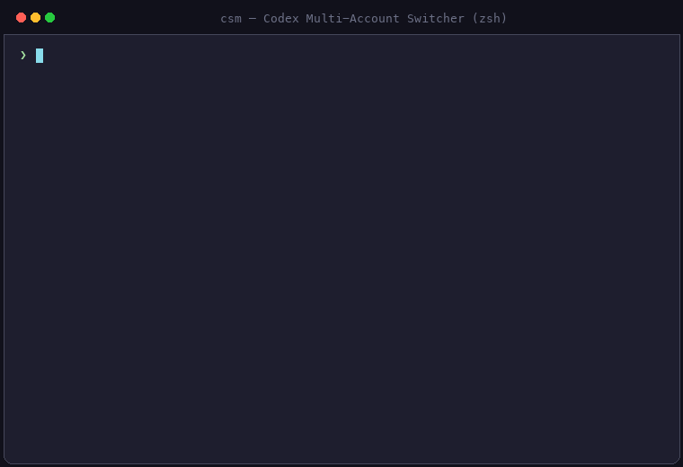

# ⚡ csm (Codex Account Switcher & Quota Manager)

[](https://github.com/mazisel/csm)
[](https://www.python.org/)
[](LICENSE)
[](https://github.com/mazisel/csm)

A powerful, safe, cross-platform **Multi-Account Switcher & Real-Time Quota Manager** for OpenAI Codex on **macOS**, **Windows**, and **Linux**.

<p align="center">
  
</p>

Easily switch between personal, work, and secondary accounts, monitor 5-hour and 7-day rate limits live, and let `csm` automatically pick the account with the most remaining quota.

---

## ✨ Features

- 🌐 **Cross-Platform:** Works natively on **macOS**, **Windows (PowerShell & CMD)**, and **Linux** with zero external pip dependencies.
- 🔄 **Zero-Disruption Account Switching:** Switch active Codex accounts in milliseconds without losing project history or session data.
- 📊 **Live Quota & Rate-Limit Visualizer (`csm status`):** See remaining percentages and reset countdowns for both **5-hour** and **7-day** windows for all your saved accounts.
- 🏆 **Smart Auto-Pick (`csm pick`):** Automatically evaluates all your accounts and switches to the one with the highest available quota.
- 🔐 **Isolated Safe Login:** Uses isolated temporary credential sandboxes during `csm add` to prevent existing refresh tokens from being revoked by OpenAI.
- 🖥️ **Codex Desktop App Integration:** Automatically restarts the macOS or Windows Codex desktop app to apply the newly switched account immediately.
- 🚀 **Self-Updating:** Keep `csm` up to date with a single `csm update` command.

---

## 📦 Quick Installation

### 🍎 macOS & 🐧 Linux (Terminal)
Run this one-liner in your terminal:
```bash
curl -fsSL https://raw.githubusercontent.com/mazisel/csm/main/install.sh | bash
```

### 🪟 Windows (PowerShell)
Open PowerShell and run:
```powershell
irm https://raw.githubusercontent.com/mazisel/csm/main/install.ps1 | iex
```

---

## 🚀 Quick Start

### 1. Add your accounts safely
```bash
csm add personal
csm add work
```
*(Each account will open a browser login safely without overriding or revoking other accounts).*

### 2. View remaining quotas and limits
```bash
csm status
```

**Example Output:**
```text
Codex Rate Limits & Usage
────────────────────────────────────────────────────────────────
● personal [plus]
   5h  ████████████████░░░░  80.0% left   reset 3h 12m
   7d  ████████████████████ 100.0% left   reset ?
   ⚡ Resets: 1 available • expires 20 Sep (17d left)

  work [team]
   5h  ████░░░░░░░░░░░░░░░░  20.0% left   reset 45m
   7d  ██████████████░░░░░░  70.0% left   reset 2d 4h
   ⚡ Resets: 1 available • expires 20 Sep (17d left) (can apply now)
   💵 Credits: $15.00

────────────────────────────────────────────────────────────────
Recommended: personal  (5h: 80.0% / 7d: 100.0% remaining)
```

### 3. Switch accounts
```bash
# Switch to an account and reload Codex Desktop App:
csm use work

# Or switch without restarting the Desktop App:
csm use work --no-restart
```

### 4. Automatically switch to the healthiest account
```bash
csm pick
```

---

## 📖 Command Reference

| Command | Description |
| :--- | :--- |
| `csm add <name>` | Securely login to a new Codex account and save it. |
| `csm refresh <name>` | Re-authenticate an existing account without revoking others. |
| `csm use <name>` | Switch active account and restart Codex Desktop App. |
| `csm use <name> --no-restart` | Switch account without restarting Codex Desktop App. |
| `csm status` | Show live 5h & 7d quota percentages, reset countdowns, and balance. |
| `csm pick` | Automatically select and switch to the account with the most quota. |
| `csm list` | List all saved accounts and show which one is currently active. |
| `csm current` | Print the name of the currently active account. |
| `csm remove <name>` | Delete a saved account from the local store. |
| `csm update` | Update `csm` directly to the latest version from GitHub. |
| `csm version` | Display the installed version of `csm`. |
| `csm help` | Show help and usage instructions. |

---

## 🔒 Security & Storage

- **Local Storage:** All authentication tokens are stored strictly on your local machine under `~/.codex-multi/accounts/` (or `%USERPROFILE%\.codex-multi\accounts\` on Windows).
- **Strict File Permissions:** Files are secured with `chmod 600` on Unix systems.
- **No Telemetry / No Third-party:** `csm` connects directly and solely to official OpenAI API endpoints (`auth.openai.com` and `chatgpt.com`).

---

## 🔄 Updating & Uninstalling

### Update
```bash
csm update
```

### Uninstall
- **macOS / Linux:**
  ```bash
  rm -f ~/.local/bin/csm
  rm -rf ~/.codex-multi
  ```
- **Windows (PowerShell):**
  ```powershell
  Remove-Item -Recurse -Force "$HOME\.local\bin\csm*"
  Remove-Item -Recurse -Force "$HOME\.codex-multi"
  ```

---

## 🇹🇷 Türkçe Açıklama

`csm`, **macOS**, **Windows** ve **Linux** üzerinde OpenAI Codex için geliştirilmiş çoklu hesap geçiş ve canlı kota takip yöneticisidir.

### Kurulum
- **macOS / Linux:** `curl -fsSL https://raw.githubusercontent.com/mazisel/csm/main/install.sh | bash`
- **Windows (PowerShell):** `irm https://raw.githubusercontent.com/mazisel/csm/main/install.ps1 | iex`

### Temel Komutlar
- **Hesap Ekle:** `csm add hesap_adi`
- **Kotaları Görüntüle:** `csm status`
- **Hesap Değiştir:** `csm use hesap_adi`
- **En Yüksek Kotalı Hesaba Geç:** `csm pick`
- **Güncelle:** `csm update`

---

## 📄 License

This project is licensed under the [MIT License](LICENSE).
